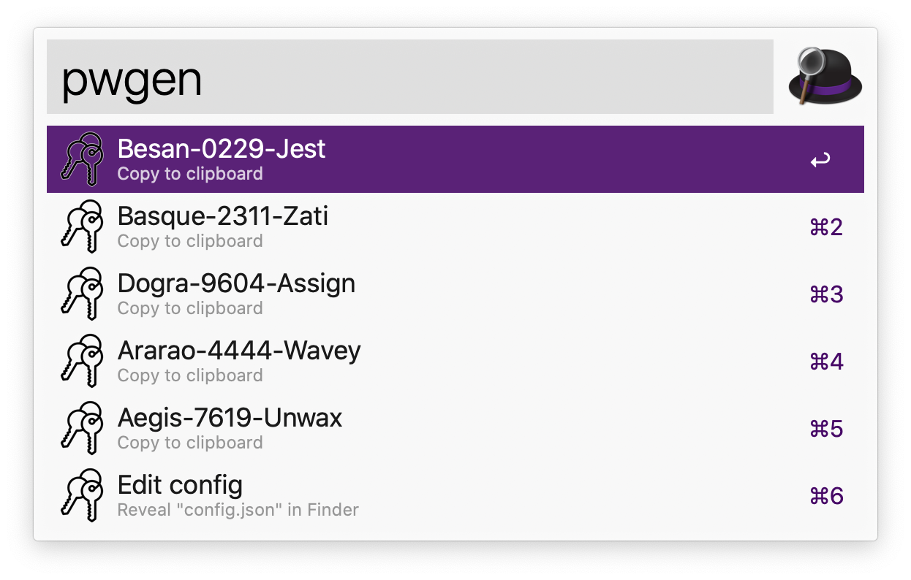

# Password Generator Alfred Workflow

## Download

[releases](https://github.com/fy-meng/pwgen-alfred-workflow/releases)

## Usages
- Use the keyword 'pwgen' to generate 5 passwords
- Select a desirable password and copy it to clipboard



## Configs
- To edit password format, use the keyword 'pwgen' and select the last option "Edit config"
- Edit `config.json` that pops up
- This workflow currently supports 3 types of password blocks: random words, random numbers and deliminators, and you can customize and re-order the blocks as you like

### Random Words
- The workflow uses `/usr/dict/words`, `/usr/share/dict/words` or a dictionary from [this Github repo](`https://gist.github.com/wchargin/8927565`) as the base dictionary and filters out all words that only contains English letters
- To add a random word block to the password, add the following block to `config.json`:

```json

{
  "RandomWord": {
    "capital": "first",
    "min_len": 3,
    "max_len": 6
  }
}
```

- `capital` can be set to `"none"`, `"first"` or `"random"`. `"none"` will make the word all lower case, `"first"` will capitalize the first letter of the word, and `"random"` will randomly capitalize the letters
- `min_len` and `max_len` controls the length of acceptable words
- The default values are is shown in the above code block. Remove any arguments to use the default values

### Random Number
- To add a list of random numbers to the password, add the following block to `config.json`:

```json

{
  "RandomNumber": {
    "num_digits": 4
  }
}
```

- `num_digits` controls the number of digits in this block of random numbers
- The default values are is shown in the above code block. Remove the arguments to use the default value


### Deliminator
- To add a deliminator or a special symbol, add the following block to `config.json`:

```json

{
  "Deliminator": {
    "c": "-"
  }
}
```

- `c` is the deliminator of arbitrary length
- The default values are is shown in the above code block. Remove the arguments to use the default value
